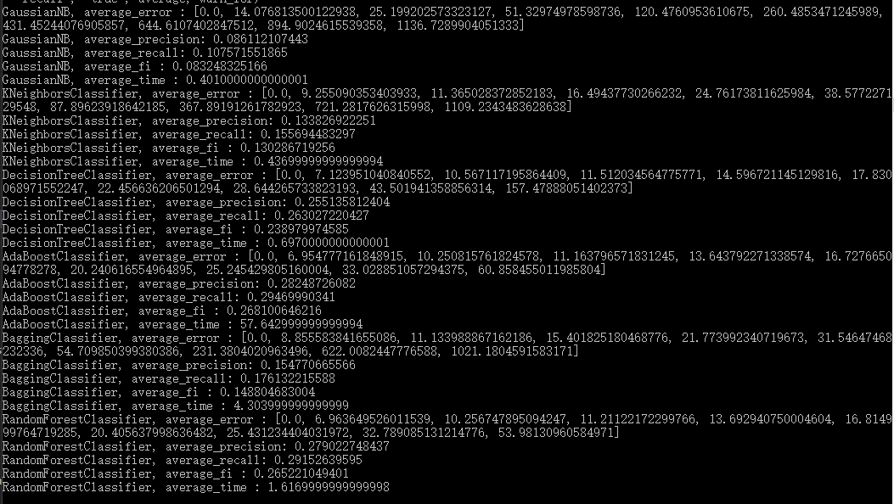
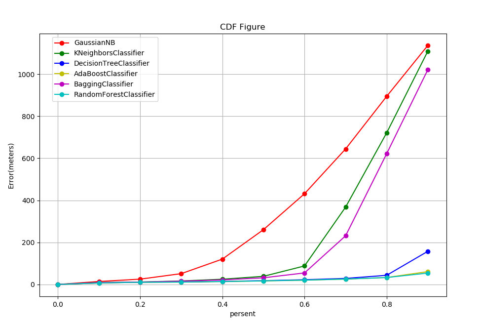
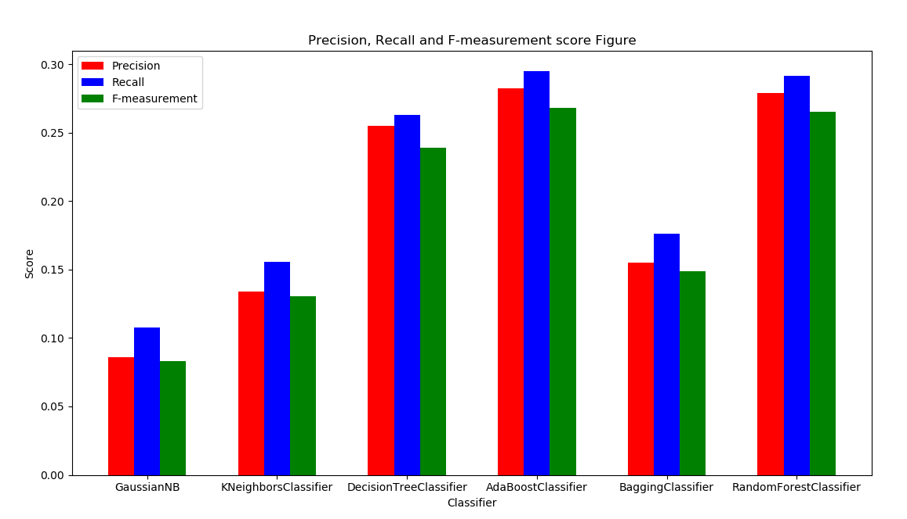
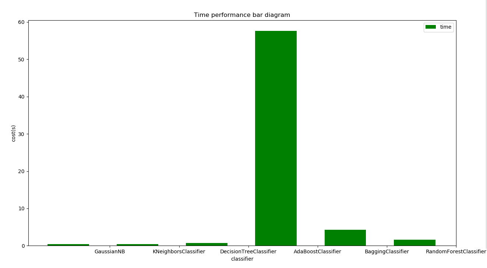
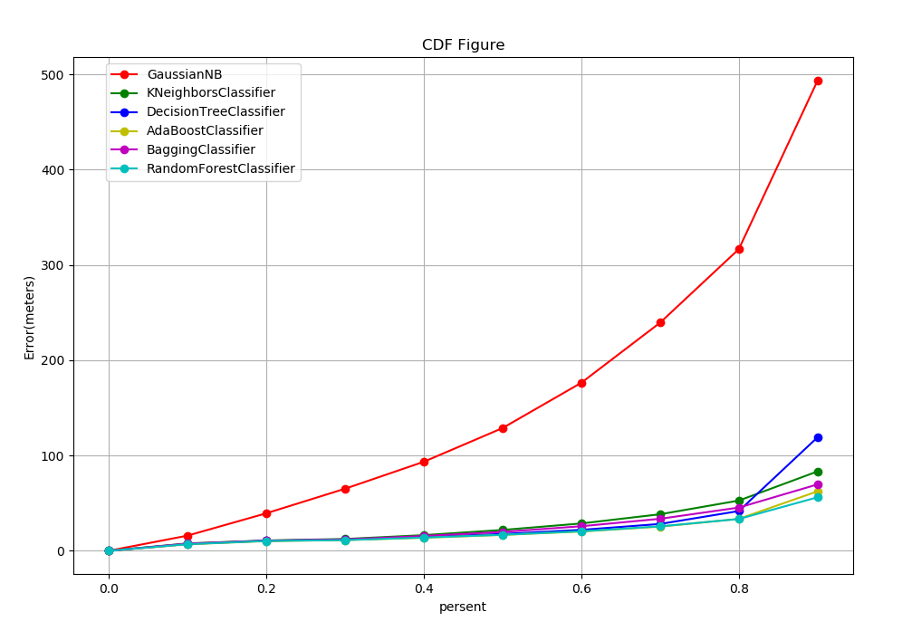
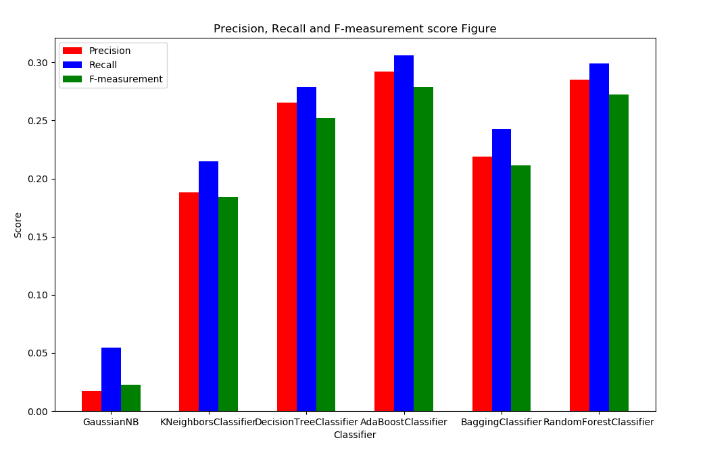

# 报告 -1a

##### 说明：

​	由于GradientBoostingClassifier分类器本身需要大量的时间，而且在我的笔记本上需要运行非常久的时间，实在是难以得到最终的结果，所以报告中只对其余6个算法进行分析，望谅解。

#### 运行结果截图

##### 各个分类器的所有结果：

##### 误差图：

​	计算误差时，由于测试集总共有1600多条数据，点的总数比较多，所以从所有的结果中取10条数据计算偏移的距离，下图横坐标x代表取测试集总数totol*x处的偏移距离，纵坐标表示在该x处得到的10次结果的平均值：

precision、recall、fi_score图：

性能比较图，运行时间比较：

#### 讨论分析：

##### 误差：

- 由于在对数据进行整合时，采取的左连接的方法对data和gongcan数据进行整合，可能生成了一些无用的字段特征，而对于数据中存在的无效值，并没有做充分的处理，这也可能导致误差
- 对于GaussianNB、KNeighbors、BaggingClassifier，得到的结果误差比较大；DecisionTree、AdaBoost、RandomFores得到的效果比较好，其中AdaBoost和RandomFores的结果几乎一致
- 高斯贝叶斯是基于高斯分布的概率模型，但不适用于非高斯分布的数据。高斯贝叶斯训练效果不好的原因可能是因为GPS数据并不符合高斯分布

##### precision、recall、fi_score：

- 从图中可以看出DecisionTree、AdaBoost、RandomFores的结果比GaussianNB、KNeighbors、Bagging稍好一些，但是普遍比较低，只有0.3不到。这是因为每个栅格只有20m，而实际预测的误差都比较大，这一点从CDF可以看出。说明除了只有很少一部分的误差是在20m以内，部分数据误差在200m以上
- GaussianNB的的准确率、召回率、F值都是最低的。

##### 性能分析：

AdaBoost和GradientBoostingClassifier所花费的时间较长，特别是后者，在本人的电脑上难以运行出结果，考虑到带来的收益相比所用的时间，不适合采用后者。

#### 优化方案：

在上述的结果中，我是将每个基站的经纬度作为一部分特征进行训练，优化之后选择每个基站的ID作为特征的一部分，并考虑对每条记录，如果基站存在，则增加大它的信号，得到结果如下：

##### 结论：

可以看到优化之后的效果明显比之前更好，除了GuassianNB之外的各个分类器的结果都很不错，而且比较均衡。这也验证了高斯贝叶斯不适合对非高斯分布的数据进行分类的猜想。

