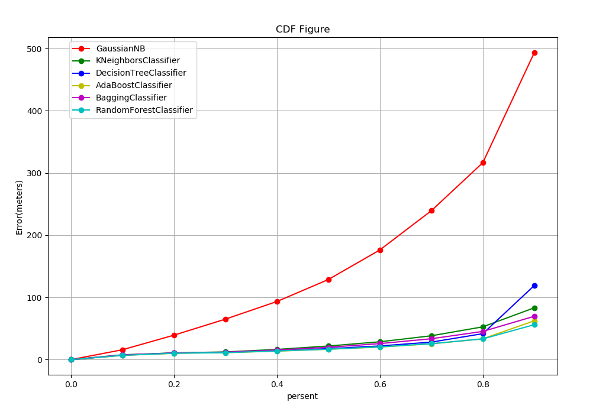
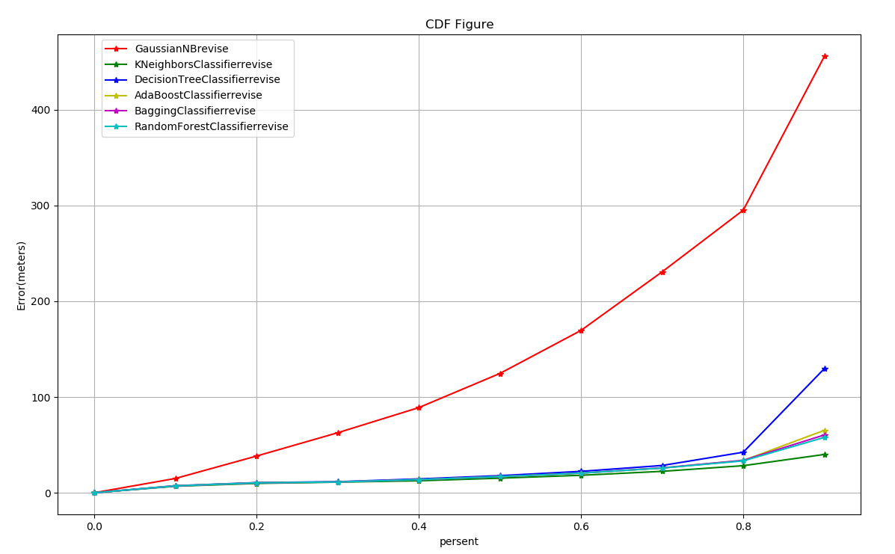
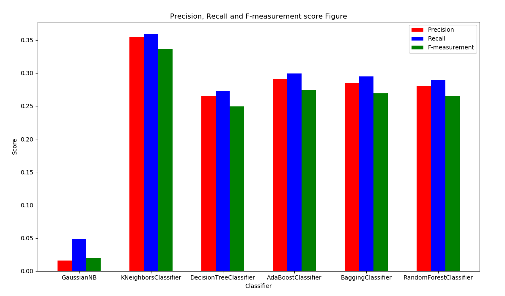
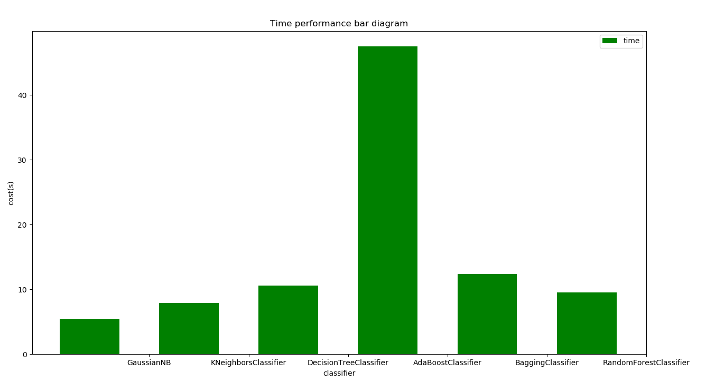

## 报告-1b

#### 算法说明：

先从a题得到预测的结果之后，考虑速度空间约束对数据进行修正，具体步骤如下：

1. 得到预测的结果之后，找出每条数据对应的IMSI账号，并进行分组，每一组代表一个IMSI账号，可以理解为一个人
2. 分组后，每组按照时间MRTime进行排序
3. 假设每组有N条数据，近似计算出第（i = 0, 1, 2...,N-1）点处的平均速度，公式v1 = D(i -1, i)/T(i - 1, i)。
4. 取一个阀值S, 如果在第i点的速度大于S则说明此处异常，将其设置为异常点的起点。（考虑到距离d是两点预测值的距离，也就是两点的栅格的中心坐标的距离，栅格的边长为20m，那么正常的速度要么是0，要么是20m/s，考虑到步行的速度，本人取S = 10m/s)
5. 从异常点i开始，如果按v1计算肯定会导致后续点异常。所以需要计算第i+1个点和第i-1个点之间的速度，设k=i + 1, i +2,...N-1 有v2 = D(i-1, k)/T(i-1, k)。
6. 显然，如果k点正常，则说明i-k之间的所有点都是异常的，最后将他们的结果修正为i-1所在的栅格即可

#### 运行结果：

##### 修成前：

- 误差

  

##### 修正后

- 误差

  

- 准确度，召回率，f1

  

- 时间

  

- ##### ​

#### 讨论分析：

- 误差：
  - 修正之后，每个分类器的结果都得到了优化，大部分数据的误差缩小到了50m以内，只有不到两成的数据是大于50m的
  - 对于GaussianNB，虽然相比之前也有所优化，但这仍然还是很差。
- 准确度、召回率、f1
  - 可见所有分类器的准确度都稍有提高，但都无法达到较高的值。
  - 实际上，从误差图可以看出大部分的数据都已经只有50m的误差了，而准确度是要求误差范围在20m以内，所以准确度、召回率都很低。
  - 可以看出，对于原本误差很大的结果，使用改进算法之后有明显的优化，但对原本误差较小的数据，并没有起到明显的优化作用。猜想可以进一步减小速度阀值S，从而使误差进一步缩小。
- 时间：
  - 由于对所得到的结构进行了改进，所以需要更多的时间。​
