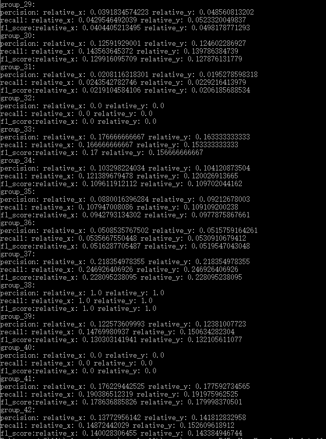
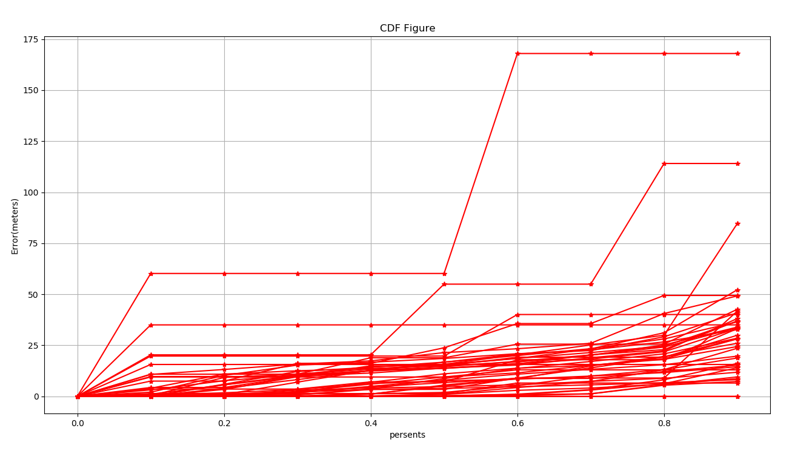

## 报告-1c

#### 运行结果：

将RNCID-CellID分组之后，总共得到43个组，分别对每个组做拆分预测，将得到的预测值(x,y)分别计算precision、recall、f1，答题结果如下：

##### 所有组的偏移图：

对每个点的偏移值，是通过将预测值和真实值的经度、纬度的差值相加，再转换为距离，这样会使得结果比实际距离要远：

#### 讨论分析：

- 由于是采用相对距离（x, y）作为标签，作为多分类问题而言，这会使得标签数过多，从而使得precision、recall、f1的结果普遍很低
- 从CDF图来看，可以看到每个组的偏移并不大，最多也就175m的误差，这说明这种类别超多的多分类问题，并不能直观的从precision看出效果
- 对数据分组之后，会出现每组的数据量不均匀的情况，分析之后发现对于数据较少的分组，训练的效果比较差，而且会出现上图中线条呈现水平直线的情况；而对于样本数较多的组，效果还不错。

#### 和a相比：

从CDF图来看，采用（x,y）作为标签，分组训练的方式得到的效果更好一些。这可能是因为a题中只能使用预测栅格的中心点作为预测坐标，使得它的误差具有一个下限值，使得整体效果变差。