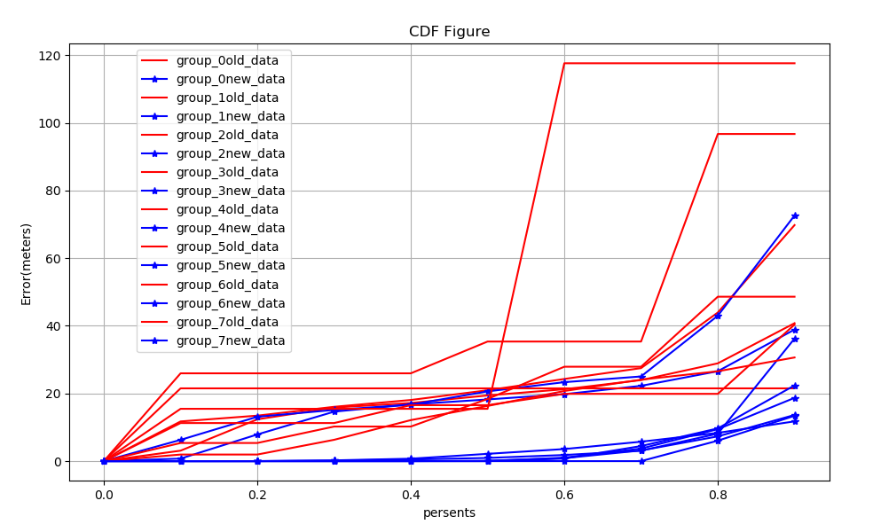
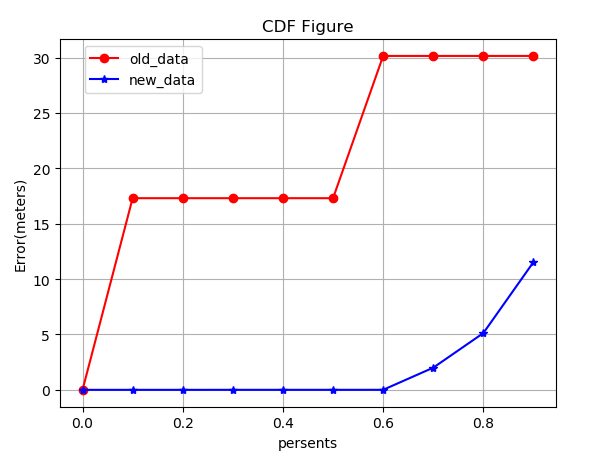
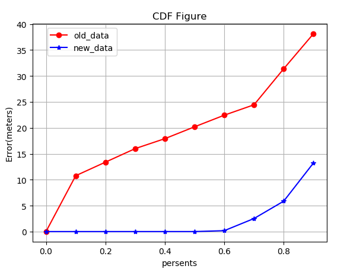
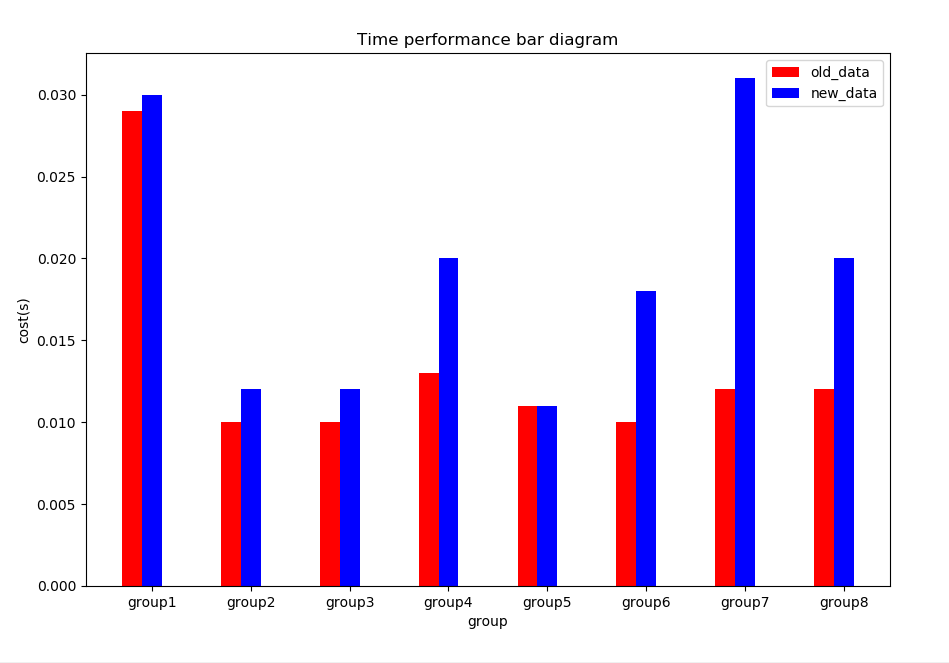
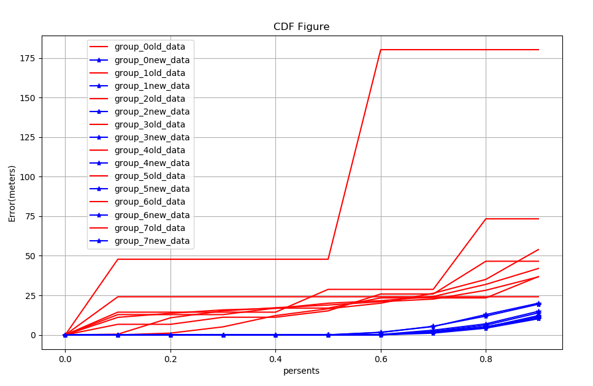
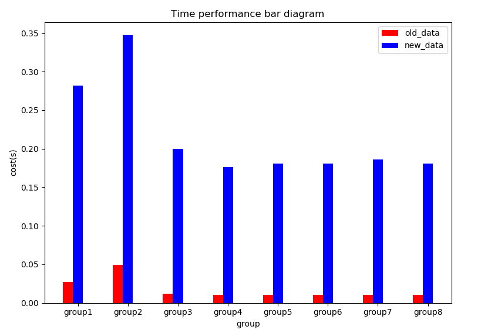

## 报告-1d

#### 运行结果：

##### 所有组新旧结果比较：

由于总共是43组所以K取8组， 红色是融入topk+之前的结果：

##### 单个组的结果（取两个具有代表行的组）：

##### 时间：

#### 讨论分析：

##### 改进方法：

取每个分组的定位模型的误差值的中位数并进行排序，分别取得中位误差最小的topk+和中位误差最小的topk-，对于topk-中的每个组，取topk+中一个组融合进去，再重新训练模型。

##### 结果分析：

优点：

- 从第一副图中很明显，优化的效果不错，误差范围甚至控制在了80m以内，
- 从单组的结果来看，融入更多的数据解决了原本分组数据量小的问题，使得训练效果更加平滑合理，避免了大的波动
- 由于是一对一融合，所以后者相对会占用跟多时间，但是并不多

缺点：

- topk+和topk-并没有直接联系，只不过是将效果好的组加入到了效果差的组中组成了新的组而已
- 由于我是将topk+和topk-一对一融合的，如果是多对一融合的话，选取的topk+组越多，效果越好，但这样会使得不同组的数据几乎一致，而且时间更多。如下是将所有topk+融入到topk-的结果：
- 
- 

总结：

适当增加topk+的融合数量，能起到不错的优化效果，但是如果太多，会导致数据不可信；太少则会导致优化效果不好。