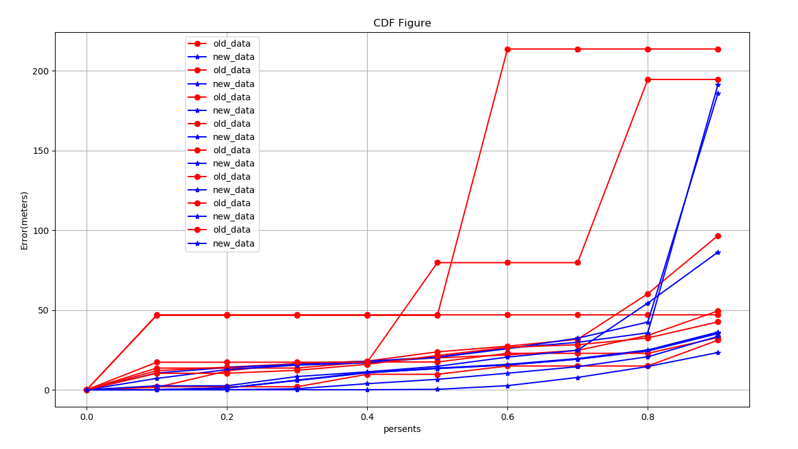
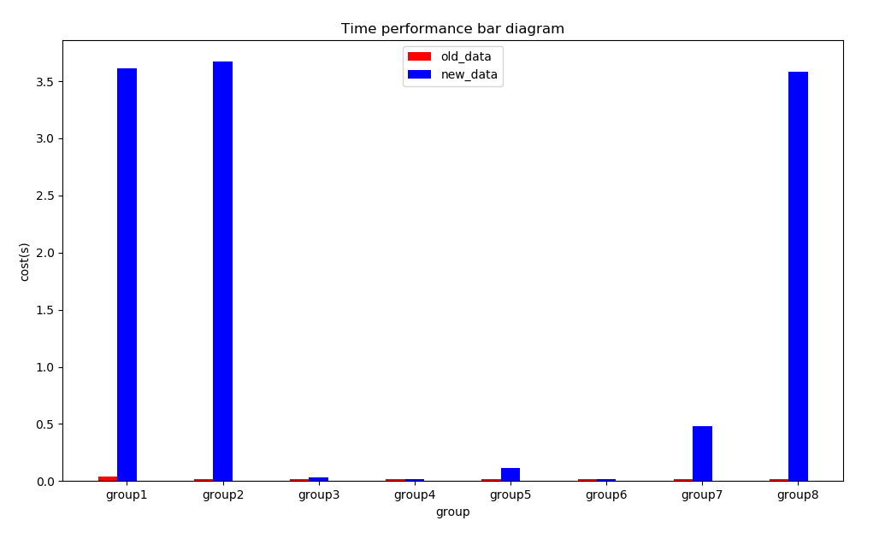
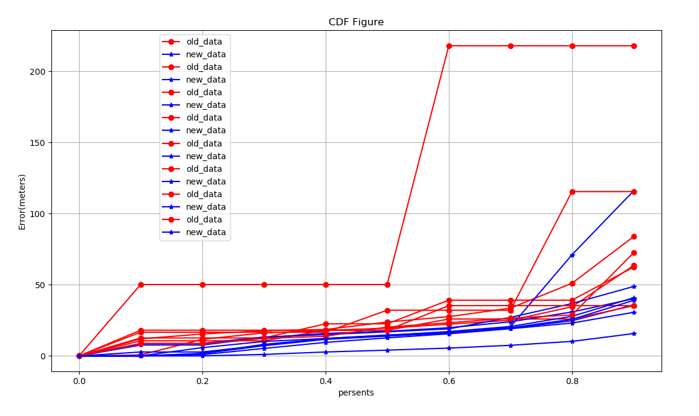
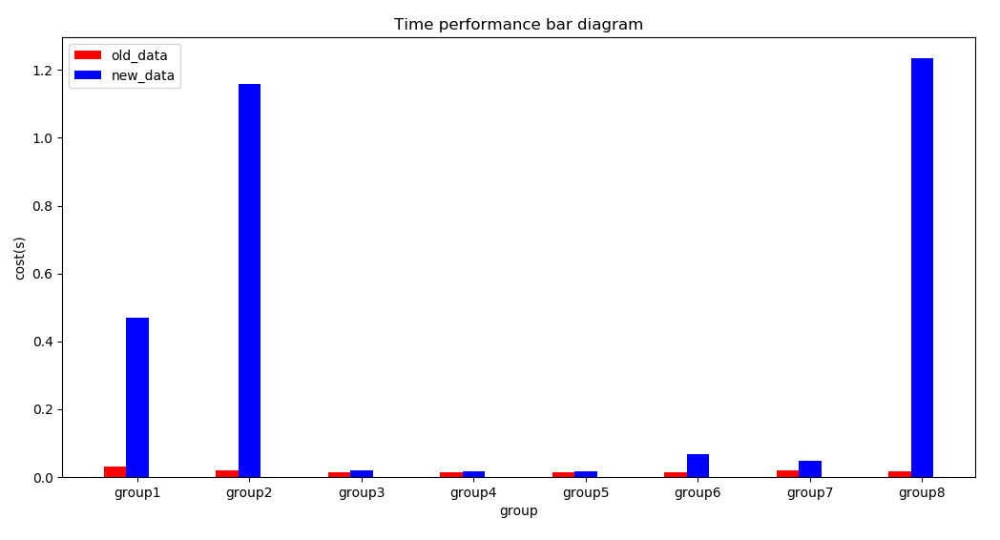

## 报告-1e

#### 说明：

本题先对提取所有基站的经纬度，并进行KMeans聚类得到不同的M个簇，然后寻找topk-中每个组所对应的簇，并将该簇中的所有组融合作为新的topk-。对于不同的M值，簇的数量、簇中包含的组的数量N就会不同。

#### 运行结果：

##### 偏差（M = 8, max(N) = 12, min(N) = 1）：

##### 时间（M = 8, max(N) = 12, min(N) = 1）：

##### 偏差（M = 12, max(N) = 8, min(N) = 1）：

##### 时间（M = 12, max(N) = 8, min(N) = 1）：

#### 讨论分析：

- 算法：本题考虑到了不同组之间的关系，利用基站数据进行聚类，构建了组与组之间的相似性，从理论上而言应该要比d题的方案更加合理
- 优化效果：虽说无论M取何值，得到的结果都会有所优化，但这可能是由于数据量增加的原因，实际上优化的效果并不是非常明显，这和d题相比效果要差一些
- 局限性：我认为，e方案构建组之间的相似性比d方案使用好数据填补坏数据的方案更加合理，但是这个方法非常依赖聚类，局限性很高。既要达到较好的聚类效果，也需要保证不同的簇的大小尽可能相似，这个要求是很高的。本题中通过不断调整参数，最终还是会有一些组被分到较大的簇中，而另一些被分配到很小的簇中，导致运行时间不均衡。而且如果聚类不合理，还会导致优化出现反效果。
- 改进：可以考虑使用更加合理的聚类方案；d中topk-组中的数据一定程度上也是相似的，应该多提取一些基站的特征进行聚类。

