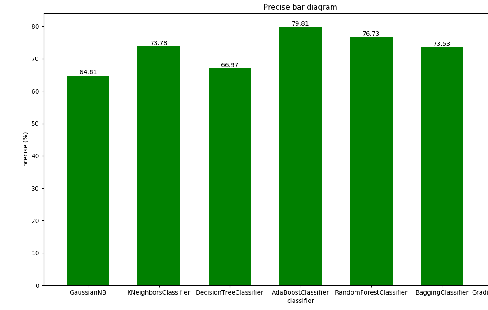
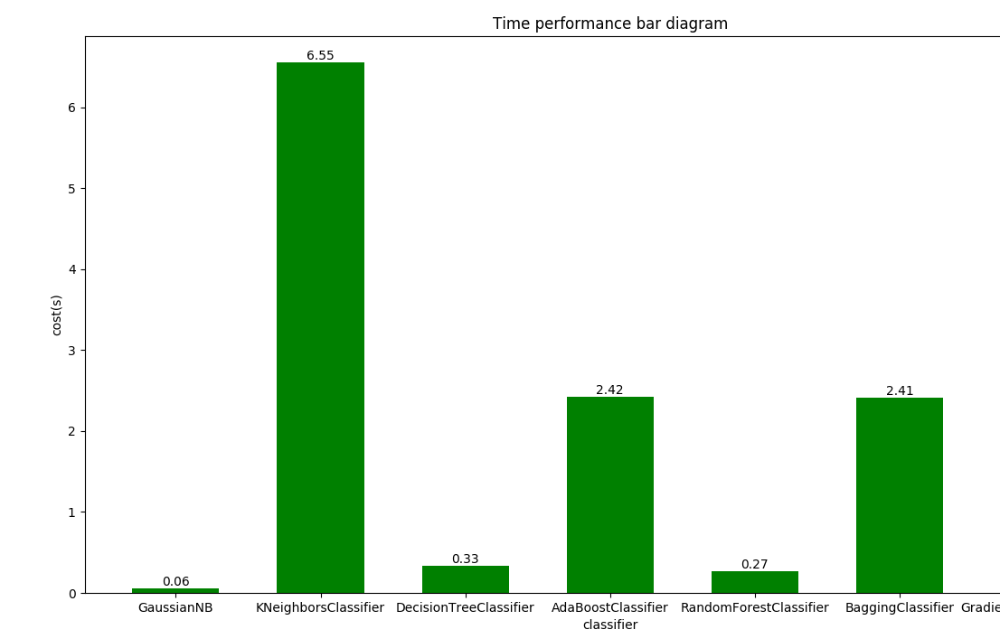

## 报告-2b:

#### 说明：

- 源数据是a题的输出output.csv，因为源文件是ANSI编码格式的，所以换成UTF-8格式另行保存
- 训练集是提取的2，3，4月份的特征；标签采用5月份的购买情况
- 测试集是5，6，7月份的特征；需要预测8月份的购买情况
- 将各个分类器的预测结果存放在result文件中

1. 特征提取：

   以vipno+pluno一起作为购买对id进行分组，将每一组进行特征提取整合后作为单独的一条数据data。整合步骤如下：

   1. 对每一组数据，以整个时间段统计的特征，与月份无关，所以组内每条数据都是一样的值，可以直接添加到data中
   2. 对a题中所有的按月份统计的特征，或者跟月份有关的特征，作为三个新的特征以代表前1、2、3个月的购买特征添加到这条数据中
   3. 本人提取了type1和type2的所有特征，一共3*（128+ 32）+ 32 + 3   = 515个 

2. 标签统计：

   同样以vipno+pluno进行分组，观察是否存在5月份的购买记录，如果存在，记为True，如果不存在，记为False

3. 训练：

   由于不存在第八月的实际购买情况，所以我在训练的时候先将预测第7月的购买情况，并适当调整提取的特征种类，最终得到结果。

#### 运行结果：

先预测第七月的数据，和正式结果比较，得到的结果如下：

#### 讨论分析：

- 从第一副图可以看到，提取了500个特征之后，模型的准确率都有70%左右
- GuassianNB的准确率最差，AdaBoost准确率最高，达到 80%，因此预测8月的结果可以更加准确
- 一般来说，并不是提取的特征越多，结果就越准确，应该考虑哪些特征是和要预测的结果的关联性，选择性的添加特征

<!--非常抱歉，由于本人水平有限，未能在有限时间内完成后面的部分，希望能酌情给分-->